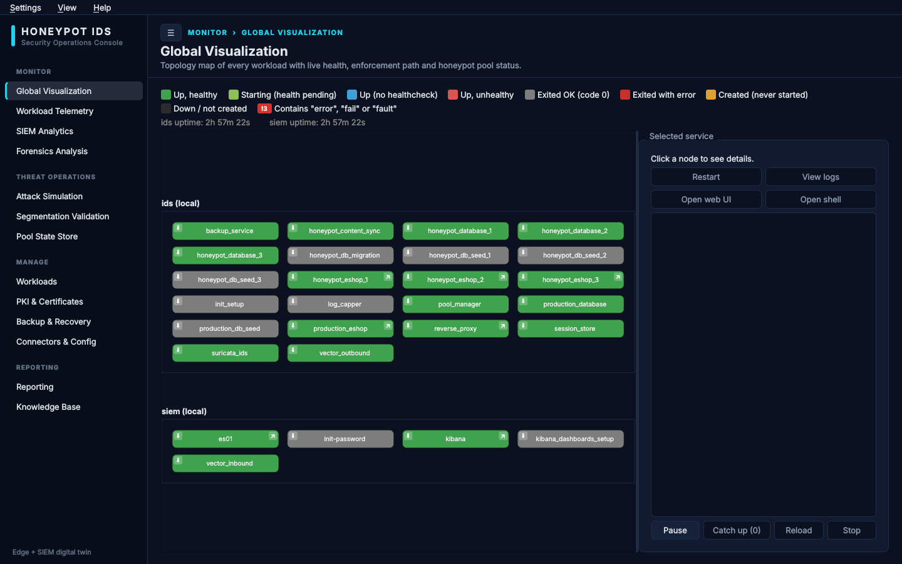
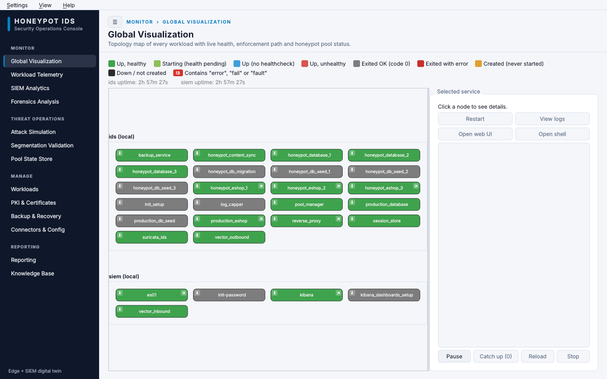
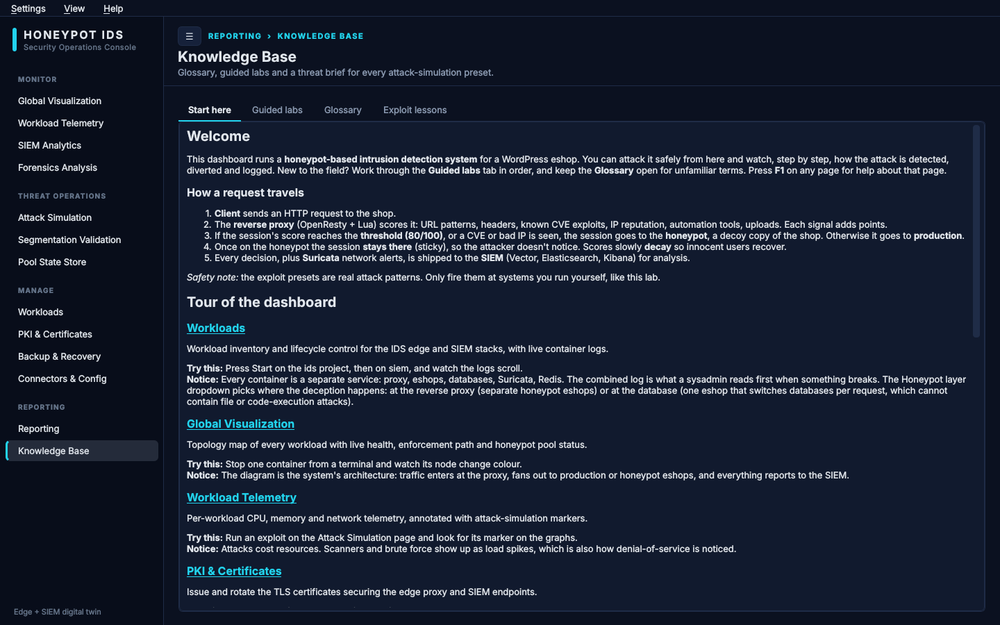
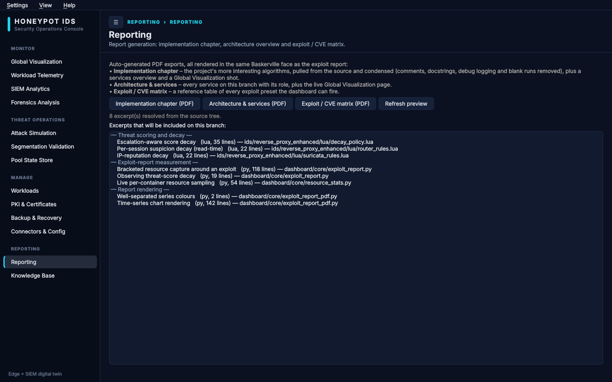
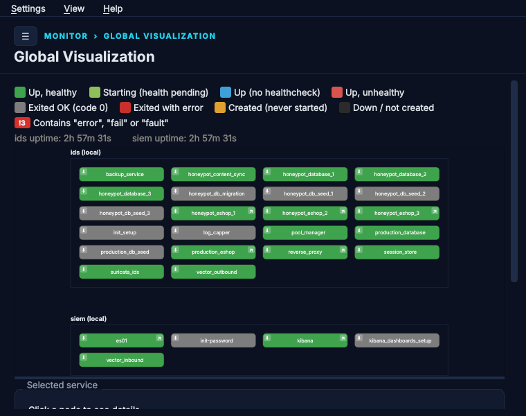

<p align="center">
  
</p>

<h1 align="center">Honeypot IDS System</h1>
<p align="center">
  <em>Zlepšenie efektivity honeypot nástroja pomocou zvýšenia úrovne interakcie</em><br>
  <em>Improving Honeypot Tool Efficiency by Increasing Interaction Level</em>
</p>

---
Ústav počítačového inžinierstva a aplikovanej informatiky, FIIT STU · Kombinované bezpečnostné riešenia

A WordPress/WooCommerce shop behind an OpenResty (Nginx + Lua) reverse proxy that scores every
request in real time and quietly diverts suspicious sessions to isolated honeypot copies of the shop,
while real customers never notice. Suricata watches the network, Redis holds session and routing
state, and logs can ship to a separate SIEM host (Elasticsearch + Kibana) over mTLS.

## Set up and run with the dashboard (recommended)

The **PyQt6 dashboard** in [`dashboard/`](dashboard/README.md) is the primary way to set this project
up and operate it. It can:

- **Upload the entire project to a remote host over SSH**, `.env` configuration included
  (`rsync` for the project, `scp` for `.env`), so a fresh VM needs nothing but Docker and an SSH login.
- **Edit the remote `.env` in place** and **remote-control Docker** there: start, restart, stop and
  purge each stack, tail logs, open a shell in a container, regenerate certificates, and watch a live
  health diagram of every container. Local and remote targets work side by side.
- Drive both stacks (`ids/` and `siem/`), run exploit scenarios against the shop, inspect Redis, manage
  backups, and export PDF reports. A setup wizard walks through all of it on first launch.

### 1. System packages (Arch Linux)

```bash
sudo pacman -S --needed git python python-pip docker docker-compose openssh rsync curl jq \
    nss alsa-lib mesa libxkbcommon-x11 libxcomposite libxdamage libxrandr libxtst xcb-util-cursor
# optional: desktop notification on first run, X11 keyboard-layout guard in run.sh
sudo pacman -S --needed libnotify xorg-xkbcomp xorg-setxkbmap
```

`docker` and `docker-compose` are required. `openssh` and `rsync` are only needed for remote
targets. The Qt/Chromium libraries are what the pip-installed PyQt6 WebEngine needs to start.

### 2. System configuration (Arch Linux)

```bash
# Docker daemon, usable without sudo (log out and back in afterwards)
sudo systemctl enable --now docker.service
sudo usermod -aG docker "$USER"

# Redis (session_store) warns about memory overcommit on every start without this
echo 'vm.overcommit_memory = 1' | sudo tee /etc/sysctl.d/99-honeypot.conf
# Elasticsearch (SIEM host only) needs a larger mmap limit
echo 'vm.max_map_count = 262144' | sudo tee -a /etc/sysctl.d/99-honeypot.conf
sudo sysctl --system
```

For remote targets you also need an SSH key that logs in to the remote host
(`ssh-copy-id user@host`) and Docker installed and running there. The settings above apply to every
host that runs the stacks.

### 3. Python environment

```bash
cd dashboard
python3 -m venv venv
./venv/bin/python3 -m pip install -r requirements.txt
```

### 4. Run it

```bash
./run.sh
```

This opens the dashboard. On first launch the wizard asks, per project (`ids` and `siem`), whether it
runs locally or on a remote host, then walks through its `.env` and optional certificate generation.

**Typical remote setup:** Connectors & Config → fill in host, SSH user, key and remote path →
*Test connection* → *Upload entire project to remote…* (this sends the `.env` too) → Workloads →
*Start*. The Workloads and Global Visualization pages then show that host's containers. The full
feature list is in [`dashboard/README.md`](dashboard/README.md).

### Screenshots

The navigation is grouped into Monitor, Threat Operations, Manage and Reporting. **Global
Visualization** is the live topology map of every container in both stacks:



The default theme follows the system's light/dark preference (Console Dark / Console Light);
Solarized and High Contrast themes are available under Connectors & Config:



**Knowledge Base** holds the glossary, guided labs and a threat brief per attack preset;
**Reporting** exports the implementation chapter, architecture overview and exploit / CVE matrix
as PDFs:

| Knowledge Base | Reporting |
|---|---|
|  |  |

In a small window the navigation folds behind the ☰ button and each page scrolls on its own:

<p align="center">
  
</p>

## Manual setup (no dashboard)

```bash
cd ids && cp .env.example .env && $EDITOR .env     # set real passwords
docker compose up -d --build                       # shop at https://localhost/ (self-signed cert)
```

The SIEM half is optional: `cd siem/certs/root-ca && ./gen_elk_certs.sh`, then `cp .env.example .env`
and `docker compose up -d` in `siem/docker`. Running both on one host is described in
[`ARCHITECTURE.md`](ARCHITECTURE.md). More commands (rebuilds, resets, backups) are in the
[manual, §1](docs/MANUAL.md#1-quick-reference).

## How it works, in short

Every request is scored in Lua (patterns, CVE signatures, rate, session history, IP reputation, with
decay over time). Sessions are identified by a signed cookie with a fingerprint fallback, not by IP.
Past a threshold a session is bound to its own honeypot pool and stays there, and shopping carts
follow it, so the diversion is invisible. The honeypot can sit at the proxy layer (separate shop
containers, default) or at the database layer (one shop, two databases).

## Repository layout

```
ids/          honeypot stack: proxy + Lua scoring, shop, pools, Redis, Suricata, Vector, tests
siem/         SIEM stack (Elasticsearch, Kibana, Vector aggregator); runs on its own host
dashboard/    PyQt6 control and test dashboard
docs/         the long-form manual
ARCHITECTURE.md   the two-host split and data flow
```

## Documentation

| Document | Contents |
|---|---|
| [`docs/MANUAL.md`](docs/MANUAL.md) | Full technical manual: commands, request pipeline, Lua modules, Redis schema, WordPress layer, detection, testing, SIEM, known issues, history |
| [`dashboard/README.md`](dashboard/README.md) | Every dashboard page, remote targets, settings and state |
| [`ARCHITECTURE.md`](ARCHITECTURE.md) | Why `ids/` and `siem/` are separate hosts, data flow, single-host testing |
| [`siem/README.md`](siem/README.md) | SIEM stack setup and the committed Kibana dashboards |
| [`ids/eshop_seed/README.md`](ids/eshop_seed/README.md) | The Fernhill demo store's catalog, images and seeding |
| [`ids/db_proxy/README.md`](ids/db_proxy/README.md) | Files used only by the database-proxy honeypot layer |
| [`ids/testing/`](ids/testing) | Attack scenarios and the blind-pentest protocol |

Licensed under the terms in [`LICENSE`](LICENSE). Primary literature is listed in
[the manual, §13](docs/MANUAL.md#13-primary-literature).
